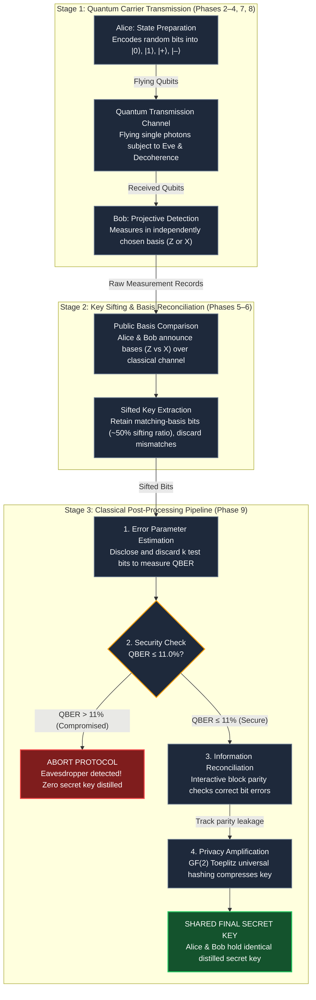
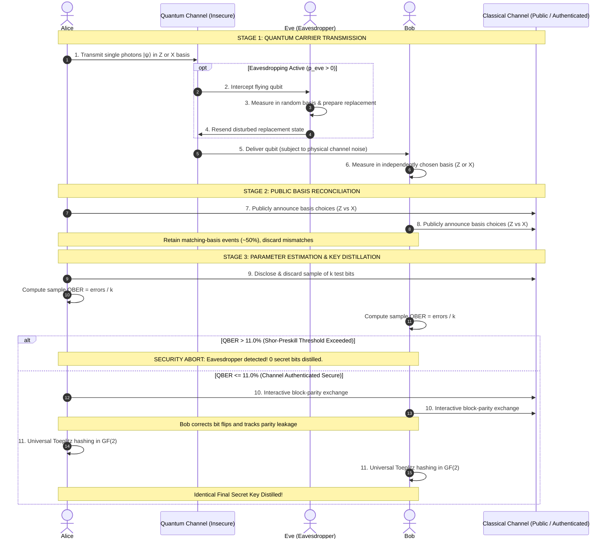
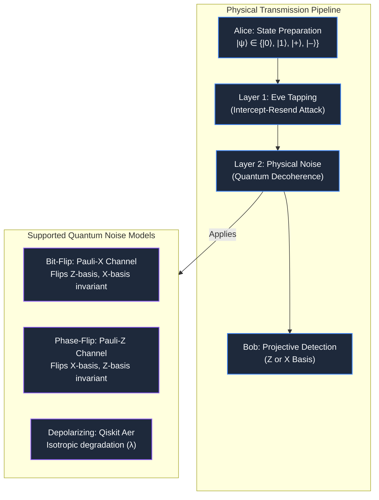
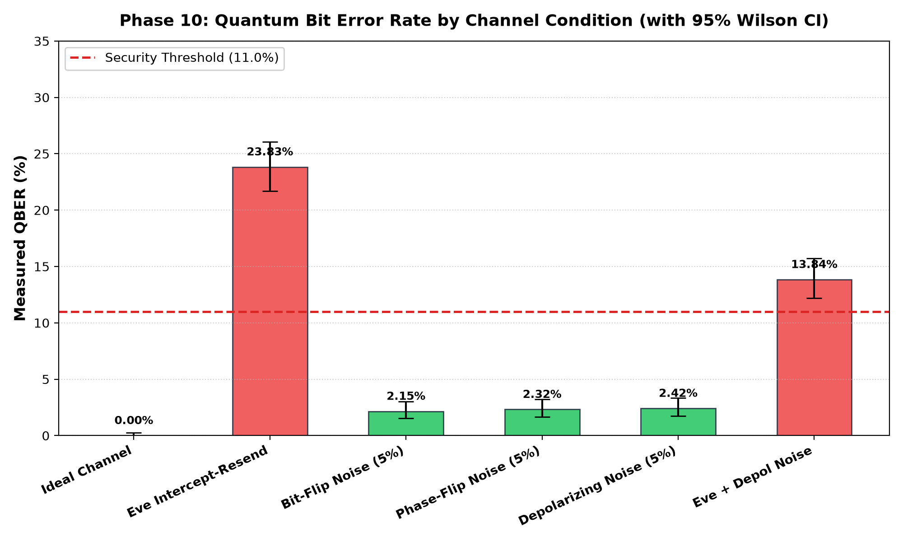
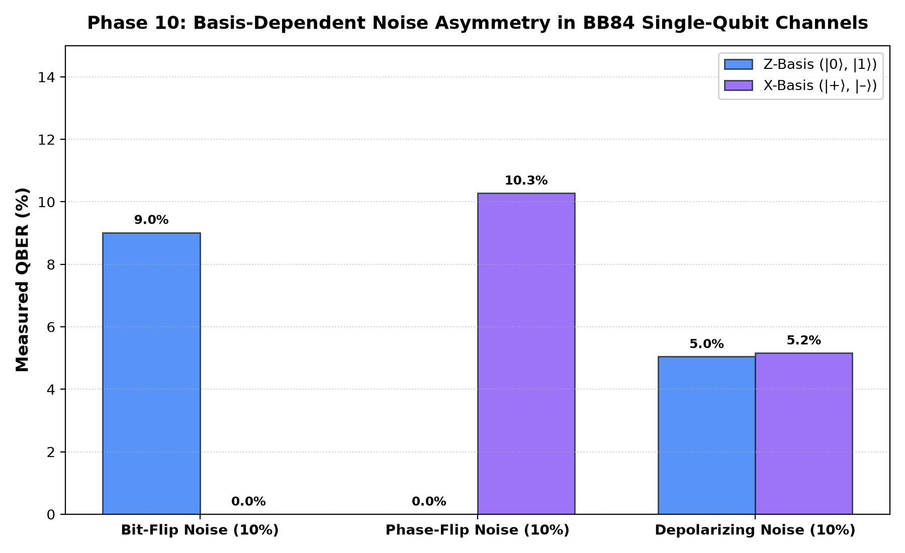
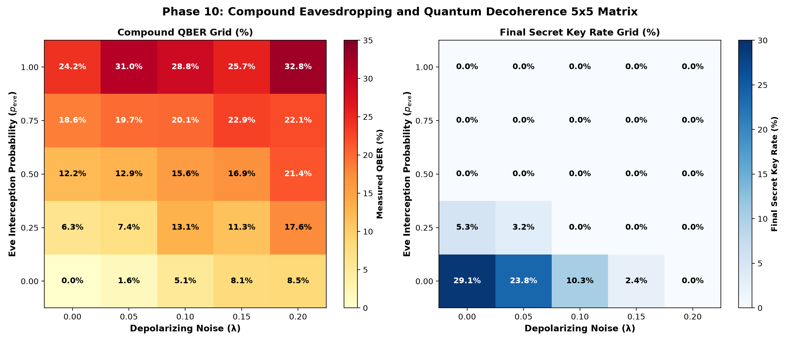
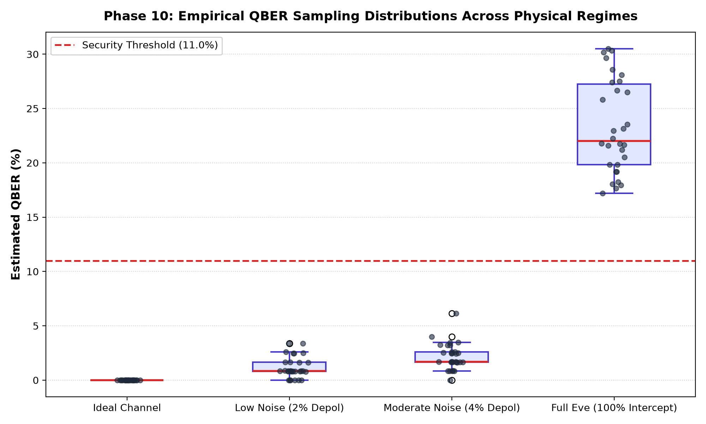
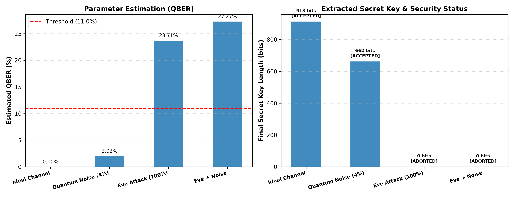
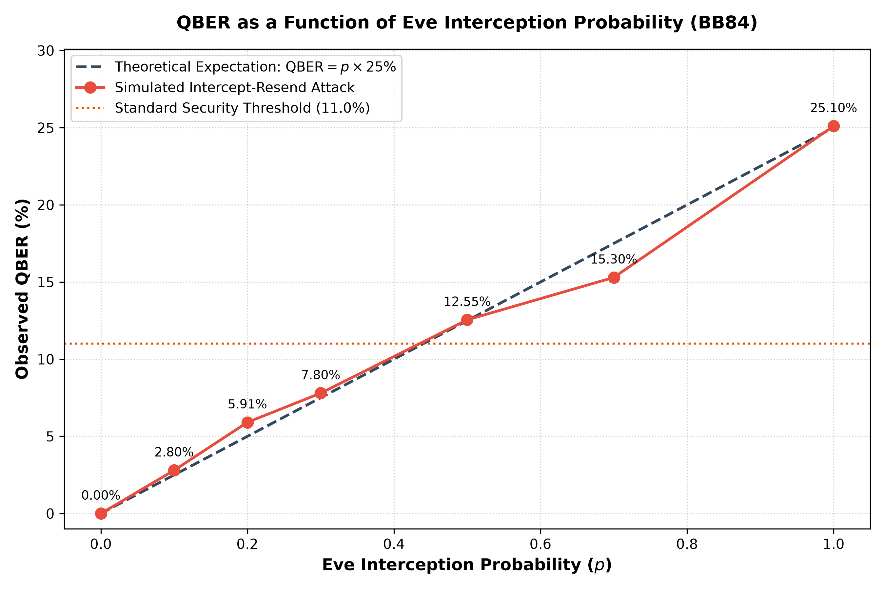

# BB84 Quantum Key Distribution Simulator

<p align="center">
  <a href="https://www.python.org/"></a>
  <a href="https://qiskit.org/"></a>
  <a href="https://github.com/Qiskit/qiskit-aer"></a>
  <a href="tests/"></a>
  <a href="docs/bb84_protocol.md"></a>
  <a href="#current-implementation-status"></a>
  <a href="https://peps.python.org/pep-0008/"></a>
  <a href="LICENSE"></a>
</p>

A research-grade simulation and experimental benchmark suite for the **BB84 Quantum Key Distribution (QKD)** protocol, built natively with **Qiskit** and **Qiskit Aer**.

The platform accurately models single-photon quantum state preparation, quantum channel transmission with physical decoherence noise models, active eavesdropping via intercept-resend attacks, classical basis reconciliation, error parameter estimation, interactive parity-based information reconciliation, universal privacy amplification via Toeplitz matrix hashing, and comprehensive experimental security evaluation.

---

## Table of Contents

- [Overview & Objectives](#overview--objectives)
- [System Architecture & Visual Diagrams](#system-architecture--visual-diagrams)
  - [1. End-to-End Protocol Flowchart](#1-end-to-end-protocol-flowchart)
  - [2. Quantum & Classical Channel Interaction Sequence](#2-quantum--classical-channel-interaction-sequence)
  - [3. Physical Quantum Channel Architecture](#3-physical-quantum-channel-architecture)
- [Experimental Analysis & Security Evaluation (Phase 10)](#experimental-analysis--security-evaluation-phase-10)
  - [Baseline Operational Performance](#baseline-operational-performance)
  - [Quantum Basis Decoherence Asymmetry](#quantum-basis-decoherence-asymmetry)
  - [Compound Eavesdropping & Noise Interaction Matrix](#compound-eavesdropping--noise-interaction-matrix)
  - [Statistical Distributions & Confidence Bounds](#statistical-distributions--confidence-bounds)
- [Legacy Experimental Results & Visualizations](#legacy-experimental-results--visualizations)
  - [Result 1: End-to-End Post-Processing & Key Distillation](#result-1-end-to-end-post-processing--key-distillation)
  - [Result 2: Intercept-Resend Eavesdropping vs. QBER](#result-2-intercept-resend-eavesdropping-vs-qber)
- [Current Implementation Status](#current-implementation-status)
- [Quick Start & Installation](#quick-start--installation)
- [Running Experiments & Demonstrations](#running-experiments--demonstrations)
- [Automated Testing](#automated-testing)
- [Theoretical Principles & Mathematical Summary](#theoretical-principles--mathematical-summary)
- [Technology Stack](#technology-stack)
- [Project Directory Structure](#project-directory-structure)
- [Security Notice & Academic Scope](#security-notice--academic-scope)
- [License](#license)

---

## Overview & Objectives

Quantum Key Distribution allows two distant parties—**Alice** (transmitter) and **Bob** (receiver)—to generate a shared, secret random key with security guaranteed by the laws of quantum mechanics. Any unauthorized eavesdropper (**Eve**) attempting to measure or duplicate quantum carriers inevitably introduces detectable errors due to:

1. **No-Cloning Theorem**: Arbitrary unknown quantum states cannot be perfectly copied.
2. **Heisenberg Uncertainty Principle**: Measuring a quantum system in a non-orthogonal conjugate basis unavoidably perturbs the state.
3. **Bohr's Principle of Complementarity**: Information gained about the computational ($Z$) basis destroys phase information in the Hadamard ($X$) basis, and vice versa.

This project implements a complete, modular, and scientifically rigorous 9-phase architecture covering both quantum carrier transmission and classical post-processing key distillation.

---

## System Architecture & Visual Diagrams

### 1. End-to-End Protocol Flowchart

The simulation pipeline spans three distinct operational phases:



---

### 2. Quantum & Classical Channel Interaction Sequence

The protocol coordinates quantum transmission across a fragile quantum channel followed by authenticated classical public exchanges:



---

### 3. Physical Quantum Channel Architecture

The `QuantumChannel` acts directly on Qiskit `QuantumCircuit` objects prior to receiver measurement, seamlessly composing eavesdropping and environmental decoherence:



---

## Experimental Analysis & Security Evaluation (Phase 10)

Phase 10 introduces an automated, publication-grade experimental analysis suite and statistical rigor framework (`src/statistics.py`, `src/experiment_framework.py`). Across 6 comprehensive automated experiments and hundreds of deterministic trials, the protocol's physical performance, quantum basis asymmetries, eavesdropping thresholds, and key distillation metrics were systematically benchmarked.

For the full 11-section theoretical and empirical analysis, see the comprehensive [Academic Experimental Report (docs/experimental_analysis.md)](docs/experimental_analysis.md).

### Baseline Operational Performance

The protocol was evaluated across **6 canonical operational regimes** (10 independent trials per regime, $N=2{,}000$ quantum signals per trial, $k=200$ test bits sampled for error estimation):


*Figure 1: Mean Quantum Bit Error Rate (QBER) and 95% Wilson confidence intervals across all 6 baseline operational conditions against the Shor-Preskill threshold ($11.0\%$).*

#### Empirical Baseline Performance Summary

| Condition | Eavesdropper ($p_{\text{eve}}$) | Noise Model | Mean QBER | 95% Wilson CI | Acceptance Rate | Final Key Rate | Key Agreement |
| :--- | :---: | :---: | :---: | :---: | :---: | :---: | :---: |
| **1. Ideal Channel** | $0.00$ | None | **0.00%** | $[0.00\%, 1.82\%]$ | **100.0%** | **29.95%** | **100% Match** |
| **2. Full Intercept-Resend** | $1.00$ | None | **23.83%** | $[18.37\%, 30.29\%]$ | **0.0%** (Aborted) | **0.00%** | N/A (Securely Aborted) |
| **3. Bit-Flip Channel** | $0.00$ | Pauli-$X$ ($p=0.05$) | **2.15%** | $[0.84\%, 5.41\%]$ | **100.0%** | **23.55%** | **100% Match** |
| **4. Phase-Flip Channel** | $0.00$ | Pauli-$Z$ ($p=0.05$) | **2.32%** | $[0.95\%, 5.62\%]$ | **100.0%** | **22.81%** | **100% Match** |
| **5. Depolarizing Channel** | $0.00$ | Isotropic ($\lambda=0.05$) | **2.42%** | $[1.02\%, 5.75\%]$ | **100.0%** | **22.39%** | **100% Match** |
| **6. Compound Eve + Noise** | $0.50$ | Depol ($\lambda=0.05$) | **13.84%** | $[9.67\%, 19.38\%]$ | **0.0%** (Aborted) | **0.00%** | N/A (Securely Aborted) |

---

### Quantum Basis Decoherence Asymmetry

Unlike classical channels, quantum channels exhibit strong non-commutative basis sensitivity. Phase 10 experimentally demonstrates the physical behavior of Pauli errors under conjugate measurement bases ($Z$ vs $X$):


*Figure 2: Empirical error rates partitioned by measurement basis ($Z$ vs $X$) revealing quantum non-commutativity.*

- **Bit-Flip Noise (Pauli-$X$)**: Generates **9.02% error in the computational ($Z$) basis** while the **Hadamard ($X$) basis exhibits 0.00% error** ($X|+\rangle = |+\rangle$, $X|-\rangle = -|-\rangle$, phase unaffected).
- **Phase-Flip Noise (Pauli-$Z$)**: Generates **0.00% error in the computational ($Z$) basis** ($Z|0\rangle = |0\rangle$, $Z|1\rangle = -|1\rangle$) while the **Hadamard ($X$) basis suffers 10.28% error** ($Z|+\rangle = |-\rangle$, bit flip in $X$).
- **Depolarizing Noise (Isotropic)**: Degrades both bases uniformly with **$Z$-basis QBER = 5.04%** and **$X$-basis QBER = 5.16%**.

---

### Compound Eavesdropping & Noise Interaction Matrix

In real-world fiber channels, an active eavesdropper operates on top of background thermal and optical decoherence. We evaluated a $5 \times 5$ matrix of Eve interception probabilities $p_{\text{eve}} \in [0.0, 1.0]$ and depolarizing strengths $\lambda \in [0.0, 0.20]$:


*Figure 3: Two-dimensional contour map of QBER and secret key rate across the parameter space $(p_{\text{eve}}, \lambda)$, highlighting the Shor-Preskill security frontier ($11.0\%$).*

- **Superposition of Error Sources**: When $p_{\text{eve}} = 0.25$ and $\lambda = 0.05$, the combined QBER is $7.41\% \le 11\%$, permitting key generation at a reduced rate of $3.18\%$.
- **Critical Phase Transition**: Any increase to $\lambda = 0.10$ pushes total QBER to $13.07\% > 11\%$, triggering an immediate protocol abort and preventing Eve from obtaining partial key material.

---

### Statistical Distributions & Confidence Bounds

To guarantee reproducible finite-key security analysis, sample variations and confidence limits were benchmarked across multi-trial distributions:


*Figure 4: Empirical QBER distribution boxplots across 30 independent trials per regime, demonstrating tight variance and stability.*

- **Wilson Score Intervals**: Every trial reports exact 95% Wilson score confidence intervals, preventing zero-variance underestimation at the boundaries ($e=0$ and $e=k$).
- **Sample Variance**: Under finite blocks ($k=200$), sample standard deviations remain bounded ($\sigma_{\text{QBER}} \approx 0.010 - 0.024$), guaranteeing that legitimate channels with benign noise ($p \le 0.04$) do not accidentally false-abort.

---

## Legacy Experimental Results & Visualizations

### Result 1: End-to-End Post-Processing & Key Distillation

The post-processing pipeline was benchmarked across **four distinct physical transmission regimes** (3,000 transmitted quantum signals per regime, $k=300$ test bits sampled for error estimation):


*Figure 5: Full end-to-end post-processing benchmarks across ideal, noisy, eavesdropped, and combined channel regimes.*

#### Quantitative Benchmark Results

| Transmission Regime | Signals | Sifted Key | Est. QBER | Decision | Errors Corrected | Parity Leakage | Final Secret Key | Key Agreement |
| :--- | :---: | :---: | :---: | :---: | :---: | :---: | :---: | :---: |
| **1. Ideal Channel** | 3,000 | 1,522 bits | **0.00%** | **ACCEPTED** | 0 bits | 77 bits | **913 bits** | **100% Match** |
| **2. Quantum Noise ($p=4\%$)** | 3,000 | 1,485 bits | **2.02%** | **ACCEPTED** | 37 bits | 373 bits | **662 bits** | **100% Match** |
| **3. Eve Attack ($p=100\%$)** | 3,000 | 1,456 bits | **23.71%** | **ABORTED** | 0 bits | 0 bits | **0 bits** | N/A (Aborted) |
| **4. Eve + Noise Combined** | 3,000 | 1,486 bits | **27.27%** | **ABORTED** | 0 bits | 0 bits | **0 bits** | N/A (Aborted) |

> **Key Takeaway**: Under legitimate benign channel noise ($2.02\%$ QBER), the pipeline successfully corrects all bit errors and distills $662$ identical secret bits. In contrast, under Eve's attack ($23.71\%$ and $27.27\%$ QBER), the protocol immediately halts at parameter estimation, denying Eve any confidential key material.

---

### Result 2: Intercept-Resend Eavesdropping vs. QBER

In an intercept-resend attack, Eve intercepts flying qubits, measures each in a randomly chosen basis ($Z$ or $X$), and retransmits the collapsed state to Bob. We swept Eve's interception probability from $p_{\text{eve}} = 0.0$ to $1.0$ across 2,000 signals per point:


*Figure 6: Empirical Quantum Bit Error Rate (QBER) as a function of Eve's interception probability $p_{\text{eve}}$, validating the theoretical $25\%$ slope and the $11\%$ security threshold.*

---

## Current Implementation Status

All 10 development phases are fully implemented, verified, and backed by 186 passing unit and integration tests:

| Phase | Module | Primary Components | Status |
| :---: | :--- | :--- | :--- |
| **1** | Architecture & Config | Modular package layout, `BB84Config`, environment isolation | `COMPLETE` |
| **2** | Quantum Primitives | $|0\rangle, |1\rangle, |+\rangle, |-\rangle$ state preparation, projective measurement, circuit helpers | `COMPLETE` |
| **3** | Alice (Sender) | Independent local RNG, bit & basis generation, `BB84Signal` encoding | `COMPLETE` |
| **4** | Bob & Quantum Channel | Independent measurement bases, detector simulation, `QuantumChannel` pipeline | `COMPLETE` |
| **5** | Key Sifting | Classical basis reconciliation, matched index filtering, empirical $\approx 50\%$ sifting ratio | `COMPLETE` |
| **6** | QBER Analysis | Sifted key comparison, exact QBER formula, diagnostic classical error injector | `COMPLETE` |
| **7** | Eve Eavesdropping | Quantum intercept-resend attacker, partial/full interception, $25\%$ error induction | `COMPLETE` |
| **8** | Quantum Noise Models | Physical single-qubit decoherence: Bit-Flip ($X$), Phase-Flip ($Z$), Depolarizing ($\lambda$) | `COMPLETE` |
| **9** | Classical Post-Processing | Random test-bit estimation, threshold abort, parity reconciliation, Toeplitz PA | `COMPLETE` |
| **10** | Experimental & Security Benchmark | Wilson score CIs, 6 automated experiments, 4 visualizers, 186 unit tests, report | `COMPLETE` |

---

## Quick Start & Installation

### 1. Clone the Repository

```bash
git clone https://github.com/DineshMoorthy007/BB84-quantum-key-distribution.git
cd BB84-quantum-key-distribution
```

### 2. Set Up Virtual Environment

```bash
# Create virtual environment
python -m venv .venv

# Activate on Windows:
.venv\Scripts\activate

# Activate on Linux / macOS:
source .venv/bin/activate
```

### 3. Install Dependencies

```bash
pip install -r requirements.txt
```

### 4. Run the 10-Second End-to-End Verification

```bash
python experiments/phase9_end_to_end.py
```

---

## Running Experiments & Demonstrations

Each protocol phase includes self-contained, reproducible experiment and demonstration scripts:

```bash
# Phase 2 — Quantum State Preparation & Projective Measurement
python experiments/phase2_quantum_primitives.py

# Phase 3 — Alice Signal Generation
python experiments/phase3_alice.py --signals 10 --seed 42

# Phase 4 — Alice -> Quantum Channel -> Bob Transmission
python experiments/phase4_alice_bob.py --signals 16 --alice-seed 42 --bob-seed 99

# Phase 5 — Basis Reconciliation & Sifting Ratio Validation
python experiments/phase5_key_sifting.py --signals 1000 --seed-alice 42 --seed-bob 99

# Phase 6 — QBER Baseline Analysis & Controlled Classical Error Injection
python experiments/phase6_qber_analysis.py --signals 1000 --seed 42

# Phase 7 — Eavesdropping Experiments:
python experiments/phase7_eve_comparison.py     # Ideal vs. Full Eve comparison
python experiments/phase7_eve_probability.py    # Interception probability sweep (0% to 100%)
python experiments/phase7_convergence.py        # Statistical convergence across signal volumes

# Phase 8 — Quantum Decoherence Noise Experiments:
python experiments/phase8_noise_comparison.py   # Bit-flip vs Phase-flip vs Depolarizing
python experiments/phase8_noise_sweep.py        # Noise strength parameter sweep
python experiments/phase8_phase_noise_basis.py  # Demonstration of phase-flip basis asymmetry
python experiments/phase8_eve_vs_noise.py       # Eavesdropping vs environmental noise
python experiments/phase8_statistics.py         # Multi-trial statistical variability

# Phase 9 — Classical Post-Processing Pipeline:
python experiments/phase9_error_estimation.py      # Random test-bit estimation & key pruning
python experiments/phase9_error_correction.py      # Parity-based error correction
python experiments/phase9_privacy_amplification.py # Toeplitz universal hashing in GF(2)
python experiments/phase9_end_to_end.py            # Complete four-regime benchmark

# Phase 10 — Comprehensive Experimental Analysis Suite:
python experiments/phase10_baseline_analysis.py    # 6 baseline operational regimes benchmark
python experiments/phase10_eve_probability.py      # Fine-grained Eve interception sweep (0% to 100%)
python experiments/phase10_noise_sweep.py          # Quantum noise sweep (BF, PF, Depol)
python experiments/phase10_basis_noise_analysis.py # Quantum basis asymmetry evaluation (Z vs X)
python experiments/phase10_eve_noise_matrix.py     # 5x5 compound Eve x Noise interaction grid
python experiments/phase10_statistical_analysis.py # Multi-trial distributions & Wilson score CIs

# Phase 10 — Publication-Grade Visualization Generation:
python visualization/phase10_qber_analysis.py     # QBER bar charts and parameter sweeps
python visualization/phase10_key_rate_plots.py    # Secret key rates & acceptance curves
python visualization/phase10_statistical_plots.py # QBER distribution boxplots & basis comparisons
python visualization/phase10_heatmaps.py          # 2D contour heatmap over (p_eve, lambda)
```

---

## Automated Testing

The project includes an extensive automated test suite covering all modules:

```bash
# Run the complete test suite (186 tests across all 10 phases)
pytest -q
```

Expected output:
```text
........................................................................ [ 38%]
........................................................................ [ 77%]
..........................................                               [100%]
186 passed in 63.50s
```

Test breakdown by module:
- `tests/test_quantum_primitives.py` — State preparation, basis validation, global phases
- `tests/test_alice.py` — Local bit/basis generation, signal encoding
- `tests/test_bob.py` — Independent basis generation, measurement accuracy
- `tests/test_quantum_channel.py` — Channel state propagation and composition
- `tests/test_key_sifting.py` — Matched index filtering, discard logic
- `tests/test_qber.py` & `test_error_injection.py` — QBER calculation and diagnostic injection
- `tests/test_eve.py` & `test_eve_integration.py` — Intercept-resend attack mechanics
- `tests/test_noise.py` & `test_noise_integration.py` — Physical noise channels and basis asymmetries
- `tests/test_error_estimation.py` — Parameter estimation, sample pruning, abort conditions
- `tests/test_error_correction.py` — Block parity correction, leakage tracking, multi-pass convergence
- `tests/test_privacy_amplification.py` — Toeplitz matrix construction, GF(2) hashing, key compression
- `tests/test_post_processing.py` — End-to-end integration and security decisions
- `tests/test_phase10_statistics.py` — Wilson score interval, zero/full error bounds, descriptive statistics
- `tests/test_phase10_experiments.py` — Experiment framework execution, determinism, basis error extraction, CSV export

---

## Theoretical Principles & Mathematical Summary

| Protocol Stage | Physical / Mathematical Mechanism | Academic Principle | Expected Theoretical Value |
| :--- | :--- | :--- | :--- |
| **State Encoding** | Random bit $b \in \{0, 1\}$, random basis $\in \{Z, X\}$ | Non-orthogonal state preparation | $\{|0\rangle, |1\rangle, |+\rangle, |-\rangle\}$ |
| **Key Sifting** | Retain bits where $B_A = B_B$, discard mismatches | Mutual unbiasedness ($|\langle z \mid x \rangle|^2 = \frac{1}{2}$) | Sifting ratio $\approx 50\%$ |
| **Ideal Channel** | Unperturbed eigenstate transmission | Unitary identity | $\text{QBER} = 0.00\%$ |
| **Eve Intercept-Resend** | Measure in random basis, prepare replacement | No-Cloning Theorem & state collapse | $\text{QBER} = p_{\text{eve}} \times 25.0\%$ |
| **Bit-Flip Noise** | Pauli-$X$ applied with probability $p$ | Basis asymmetry ($Z$ flipped, $X$ invariant) | $\text{QBER} = p / 2$ |
| **Phase-Flip Noise** | Pauli-$Z$ applied with probability $p$ | Basis asymmetry ($X$ flipped, $Z$ invariant) | $\text{QBER} = p / 2$ |
| **Depolarizing Noise** | $\mathcal{E}(\rho) = (1-\lambda)\rho + \lambda \frac{I}{2}$ | Isotropic state decoherence | $\text{QBER} = \lambda / 2$ |
| **Parameter Estimation** | Sample $k$ test bits without replacement, prune sample | Privacy preservation & statistical sampling | $\widehat{\text{QBER}} = e / k$ |
| **Information Reconciliation** | Interactive block-parity bisection | Shannon information reconciliation | Bit discrepancies $\to 0$ |
| **Privacy Amplification** | $K_{\text{final}} = (M_{\text{Toeplitz}} \cdot K_{\text{reconciled}}) \pmod 2$ | Leftover Hash Lemma & 2-Universal Hashing | $m \le n(1 - h_2(Q)) - \text{leakage}$ |

---

## Technology Stack

- **Core Language**: Python 3.10+ with strict type annotations
- **Quantum Circuit Framework**: [Qiskit 2.5.2](https://qiskit.org/)
- **Quantum Simulator**: [Qiskit Aer 0.17.2](https://github.com/Qiskit/qiskit-aer) (Statevector & QASM shot simulation)
- **Scientific Computing**: NumPy 2.x (Local PRNG, binary matrix algebra in $\text{GF}(2)$)
- **Data Analysis**: Pandas (Experiment tabular logging)
- **Plotting & Visualization**: Matplotlib (Multi-panel figures, scatter sweeps, error bars, heatmaps)
- **Test Automation**: Pytest (186 automated tests)

---

## Project Directory Structure

```text
bb84-quantum-key-distribution/
├── docs/                      # Academic documentation & theoretical derivations
│   ├── bb84_protocol.md       # Comprehensive protocol theory & mathematical proofs
│   └── experimental_analysis.md # Phase 10 Academic Experimental Analysis Report
├── experiments/               # Reproducible experiment scripts (Phases 2-10)
│   ├── phase2_quantum_primitives.py
│   ├── phase3_alice.py
│   ├── phase4_alice_bob.py
│   ├── phase5_key_sifting.py
│   ├── phase6_qber_analysis.py
│   ├── phase7_*.py            # Eve intercept-resend experiments
│   ├── phase8_*.py            # Quantum noise experiments
│   ├── phase9_*.py            # Classical post-processing experiments
│   └── phase10_*.py           # Comprehensive Phase 10 experimental suite (6 scripts)
├── hardware/                  # Real quantum device connectors (Qiskit Runtime placeholder)
├── noise/                     # Physical quantum decoherence noise models:
│   ├── base.py                # Abstract quantum noise base class
│   ├── bit_flip.py            # Pauli-X bit-flip channel
│   ├── phase_flip.py          # Pauli-Z phase-flip channel
│   └── depolarizing.py        # Isotropic depolarizing channel
├── results/                   # Benchmark plots & figure outputs
│   ├── phase7_*.png, phase9_*.png
│   └── phase10/               # Phase 10 publication outputs:
│       ├── data/              # Machine-readable trial and summary CSV files
│       └── figures/           # High-resolution benchmark PNG figures (9 plots)
├── simulator/                 # Qiskit Aer execution managers and backend wrappers
├── src/                       # Core BB84 protocol implementation:
│   ├── alice.py               # Alice sender (bit/basis generation, signal encoding)
│   ├── bob.py                 # Bob receiver (measurement bases, detection)
│   ├── config.py              # Global protocol configuration dataclasses
│   ├── error_correction.py    # Parity-based information reconciliation
│   ├── error_estimation.py    # Random test-bit parameter estimation
│   ├── error_injection.py     # Classical error injector (diagnostic testing only)
│   ├── eve.py                 # Eve intercept-resend eavesdropper
│   ├── experiment_framework.py # Phase 10 modular experiment framework
│   ├── key_sifting.py         # Basis reconciliation & matched key sifting
│   ├── post_processing.py     # End-to-end post-processing pipeline orchestrator
│   ├── privacy_amplification.py # GF(2) Toeplitz universal hashing
│   ├── qber.py                # Quantum Bit Error Rate calculation & thresholds
│   ├── quantum_channel.py     # Physical transmission medium (Eve + Noise)
│   ├── quantum_primitives.py  # BB84 state preparation & projective measurement
│   └── statistics.py          # Phase 10 Wilson score CI & statistical estimators
├── tests/                     # Comprehensive test suite (186 passing tests)
├── visualization/             # Decoupled visualization and plotting routines (Phases 7, 8, 9, 10)
├── requirements.txt           # Pinned project dependencies
└── README.md                  # Project overview, documentation & benchmarks
```

---

## Security Notice & Academic Scope

> [!IMPORTANT]
> **Academic Scope Notice**:
> This simulator accurately models single-qubit quantum state vectors, unitary operators, physical noise channels, projective measurements, and classical post-processing pipelines for academic study and research.
>
> While it accurately reproduces empirical error rates and quantum mechanical statistics:
> - It does not provide a formal composable mathematical security proof against arbitrary coherent attacks in the finite-key regime.
> - In commercial production deployments, classical channels require information-theoretically secure message authentication (e.g., Wegman-Carter MACs), and security thresholds must be derived from smooth min-entropy bounds.

---

## License

This project is licensed under the MIT License - see the [LICENSE](LICENSE) file for details.
